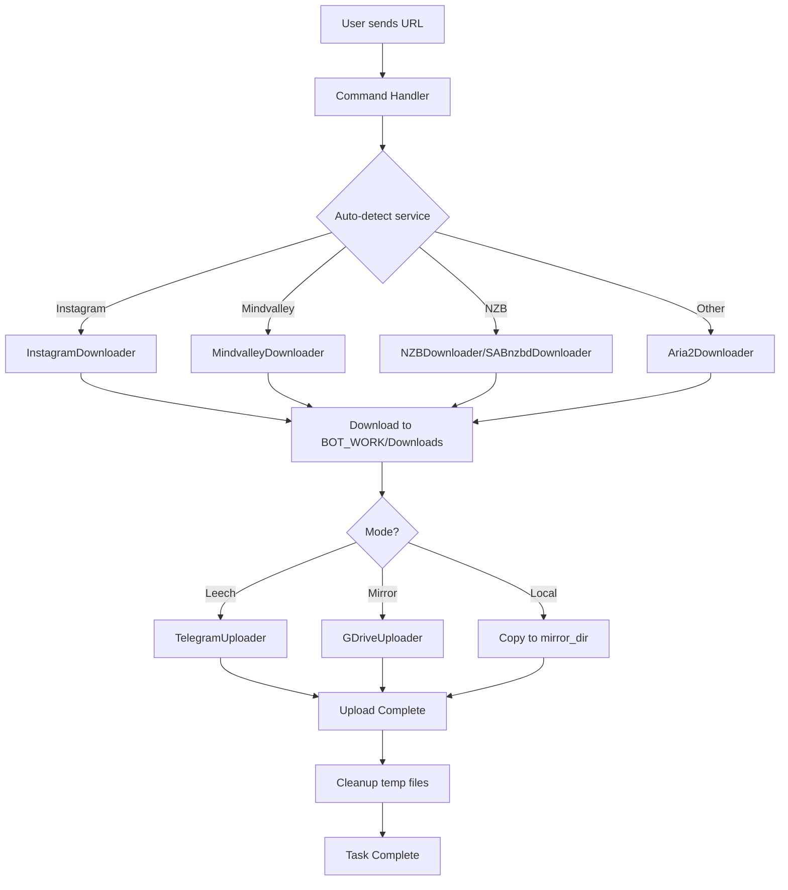
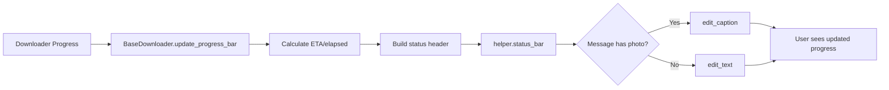

# Architecture Overview

This document provides a comprehensive overview of the Telegram-Leecher bot's architecture, design patterns, and system organization.

## Table of Contents

1. [System Overview](#system-overview)
2. [Directory Structure](#directory-structure)
3. [Core Components](#core-components)
4. [Design Patterns](#design-patterns)
5. [Data Flow](#data-flow)
6. [Multi-Task Support](#multi-task-support)

---

## System Overview

Telegram-Leecher is a Telegram bot designed to download files from various sources and upload them to Telegram or Google Drive. It's optimized to run in Google Colab but can also run locally.

### Key Features

- **Multiple Download Sources**: Direct links, Torrents, Mega, GDrive, YouTube, Terabox, Mindvalley, Instagram, NZB/Usenet
- **Multiple Upload Targets**: Telegram (leech), Google Drive (mirror), Local directory
- **File Processing**: ZIP compression, archive extraction, custom filenames
- **Progress Tracking**: Real-time progress bars with thumbnails
- **Parallel Downloads**: Multi-task support for concurrent operations

---

## Directory Structure

```
Colab_Telegram_Leecher/
├── colab_leecher/              # Main bot module
│   ├── __main__.py            # Command handlers and bot entry point
│   ├── __init__.py            # Module initialization
│   ├── aliases.py             # Command aliases
│   ├── gdrive_utils.py        # Google Drive utilities
│   │
│   ├── downlader/             # Download handlers
│   │   ├── base.py           # BaseDownloader class (shared functionality)
│   │   ├── aria2.py          # Aria2 downloader (torrents, direct links)
│   │   ├── gdrive.py         # Google Drive downloader
│   │   ├── instagram.py      # Instagram downloader
│   │   ├── mega.py           # Mega.nz downloader
│   │   ├── mindvalley.py     # Mindvalley M3U8 stream downloader
│   │   ├── nzb.py            # NZB/Usenet downloader (native)
│   │   ├── sabnzbd_downloader.py  # SABnzbd-based NZB downloader
│   │   ├── telegram.py       # Telegram file downloader
│   │   ├── terabox.py        # Terabox downloader
│   │   ├── ytdl.py           # yt-dlp downloader
│   │   ├── requests_dl.py    # Simple HTTP requests downloader
│   │   └── manager.py        # Auto-detection and routing logic
│   │
│   ├── uploader/              # Upload handlers
│   │   ├── telegram.py       # Telegram uploader (leech mode)
│   │   └── gdrive.py         # Google Drive uploader (mirror mode)
│   │
│   └── utility/               # Helper functions and utilities
│       ├── handler.py        # Message handlers
│       ├── helper.py         # General utility functions (status_bar, URL detection)
│       ├── variables.py      # Global state management (BOT, MSG, Paths)
│       ├── task_manager.py   # Task orchestration and lifecycle
│       ├── task_context.py   # Per-task state isolation (multi-task support)
│       ├── task_dashboard.py # Task progress visualization
│       ├── transfer_state.py # Upload/download state tracking
│       ├── converters.py     # File format converters
│       ├── sabnzbd_client.py # SABnzbd API client
│       ├── sabnzbd_setup.py  # SABnzbd setup and configuration
│       └── sabnzbd_autodetect.py  # SABnzbd auto-detection logic
│
├── colab/                     # Colab-specific files
│   ├── setup_cell.py         # Main Colab setup script
│   ├── sabnzbd_setup.py      # SABnzbd setup for Colab
│   └── cells/                # Notebook cells
│       ├── main_setup.py     # Alternative main setup
│       ├── error_logger.py   # Error logging cell (simple + full modes)
│       ├── streaming_extraction.py  # Streaming ZIP extraction
│       └── fixed_notebook.py # Fixed notebook cell
│
├── scripts/                   # Utility scripts
│   ├── downloaders/          # Download scripts
│   │   └── download_from_downloadly.py
│   └── utils/                # Utility tools
│       ├── capture_existing_logs.py
│       ├── convert_cookies.py
│       ├── extract_finra_simple.py
│       └── streaming_extract_function.py
│
├── tests/                     # Test files
│   ├── test_*.py             # Unit tests
│   ├── quick_test.py         # Quick integration test
│   ├── debug/                # Debug scripts
│   │   ├── instagram_debug.py  # Instagram debugging (unified)
│   │   ├── check_bot_info.py
│   │   ├── check_sabnzbd_logs.py
│   │   ├── debug_bot_startup.py
│   │   └── debug_nzb_command.py
│   └── fixtures/             # Test data and fixtures
│
├── docs/                      # Documentation
│   ├── setup/                # Setup guides
│   ├── features/             # Feature-specific guides
│   ├── development/          # Development docs
│   │   ├── ARCHITECTURE.md  # This file
│   │   ├── CLAUDE.md        # Claude Code development guidelines
│   │   ├── CONTRIBUTING.md  # Contribution guidelines
│   │   └── mirror_function.txt  # Mirror mode documentation
│   └── tutorials/            # User tutorials
│
├── browser-extension/         # Mindvalley stream detector
│   ├── manifest.json
│   ├── background.js
│   ├── content.js
│   └── popup.html/js
│
├── notebooks/                 # Jupyter notebooks
├── BOT_WORK/                  # Runtime working directory
│   └── Downloads/            # Download destination
│
├── run_bot_local.py          # Local bot runner
├── requirements.txt           # Python dependencies
├── credentials.json          # Bot credentials (gitignored)
├── credentials.json.example  # Credentials template
└── README.md                  # Project documentation
```

---

## Core Components

### 1. Bot Core (`colab_leecher/__main__.py`)

The entry point and command handler for the bot.

**Key Functions:**
- Command registration (`/start`, `/tupload`, `/gdupload`, `/ytupload`, etc.)
- URL routing to appropriate downloaders
- User interaction and menu systems
- Settings management

**Flow:**
```
User sends command → Handler processes → Routes to appropriate downloader → Uploads via uploader
```

### 2. Download Layer (`colab_leecher/downlader/`)

Each downloader implements the following pattern:

```python
class XxxDownloader(BaseDownloader):  # Inherits common functionality
    def __init__(self, client, message, task_ctx=None):
        super().__init__(client, message, task_ctx)
        # Downloader-specific initialization

    async def download(self, url, output_dir):
        # Download implementation
        # Uses self.update_progress_bar() for progress updates
        return success, file_path
```

**BaseDownloader** provides:
- Progress tracking variables (`download_start_time`, `current_percentage`)
- Standard `update_progress_bar()` method
- Task context management
- Download directory resolution

**Downloader Selection Logic:**
1. User specifies service type (e.g., `/ig` for Instagram)
2. URL auto-detection in `manager.py` (calls `is_instagram()`, `is_mega()`, etc.)
3. Appropriate downloader instantiated and executed

### 3. Upload Layer (`colab_leecher/uploader/`)

Handles file uploads after download completes.

**Upload Modes:**
- **Leech**: Upload to Telegram (`telegram.py`)
- **Mirror**: Upload to Google Drive (`gdrive.py`)
- **Local**: Copy to local directory (handled in task_manager.py)

### 4. State Management (`colab_leecher/utility/variables.py`)

Global state containers:

```python
class BOT:
    class Setting:     # User preferences (thumbnail, caption style, etc.)
    class Options:     # Current operation options (custom_name, zip_pswd, etc.)
    class Mode:        # Operation mode (leech/mirror/gdrive, normal/zip/unzip)
    class State:       # Bot state flags (task_going, waiting states)

class MSG:             # Current status message reference
class Paths:           # File paths (down_path, up_path, mirror_dir)
class BotTimes:        # Timing information
class TRANSFER:        # Upload/download progress tracking
```

### 5. Task Management (`colab_leecher/utility/task_manager.py`)

Orchestrates the entire download-upload lifecycle.

**Key Functions:**
- `task_starter()`: Initializes task, downloads random thumbnail, sends initial message
- `handle_task_completion()`: Cleanup after task finishes
- `Do_Leech()`, `Do_Mirror()`: Execute leech/mirror operations
- `task_manager()`: Main task orchestration loop

**Lifecycle:**
```
task_starter() → Download → Process (zip/unzip) → Upload → Cleanup
```

### 6. Multi-Task Support (`colab_leecher/utility/task_context.py`)

**TaskContext** encapsulates per-task state for parallel downloads:

```python
class TaskContext:
    task_id: str           # Unique task identifier
    bot: BOT instance      # Task-specific bot state
    paths: Paths instance  # Task-specific paths
    status_msg: Message    # Task's status message
    transfer: TRANSFER     # Task's transfer state
```

This allows multiple downloads to run concurrently without state conflicts.

---

## Design Patterns

### 1. **Base Class Pattern** (Downloaders)

All downloaders inherit from `BaseDownloader` to share:
- Progress tracking logic
- Standard progress bar updates
- Task context management

**Benefits:**
- Reduced code duplication
- Consistent progress bar behavior
- Easier maintenance

### 2. **Strategy Pattern** (Download/Upload)

Different downloaders/uploaders are interchangeable strategies selected at runtime based on URL type or user choice.

### 3. **State Container Pattern** (BOT, MSG, Paths)

Global state stored in class containers instead of loose variables, providing:
- Organized namespace
- Easy state inspection
- Clear ownership

### 4. **Context Isolation Pattern** (Multi-Task)

Each task gets its own `TaskContext` to avoid state collisions:

```python
# Old (single-task): Uses global MSG.status_msg
await MSG.status_msg.edit_text(text)

# New (multi-task): Uses task-specific message
await task_ctx.status_msg.edit_text(text)
```

### 5. **Progress Bar Template Pattern**

Standard progress bar format enforced across all downloaders:

```
🎬 [Service Name] Download »

🎯 Stream » [Type]

╭「████████░░░░」 » 66.7%
├⚡️ Speed » 5.2 MB/s
├⚙️ Engine » [Downloader]
├⏳ ETA » 2m 15s
├⏱️ Elapsed » 4m 30s
├✅ Done » Downloading...
╰📦 Total » 500 MB
```

Implemented in `helper.py:status_bar()` and used via `BaseDownloader.update_progress_bar()`.

---

## Data Flow

### Download → Upload Flow



### Progress Update Flow



---

## Multi-Task Support

### Architecture

**Phase 1**: Single-task mode (legacy)
- Global state in `MSG`, `BOT`, `Paths`
- One download at a time

**Phase 2**: Multi-task mode (current)
- Each task has its own `TaskContext`
- Parallel downloads with isolated state
- Task dashboard for monitoring multiple tasks

### Implementation

```python
# Creating a new task
task_ctx = TaskContext(client, message)

# Passing context through the stack
downloader = MindvalleyDownloader(client, message, task_ctx=task_ctx)
await downloader.download(url)

# Progress updates use task-specific message
await status_bar(..., task_ctx=task_ctx)
```

### Task Dashboard

Visual representation of multiple ongoing tasks:

```
📊 Active Tasks (3)
──────────────────
[abc123] Mindvalley » 45% | ⏳ 5m
[def456] Instagram » 78% | ⏳ 1m
[ghi789] NZB Download » 12% | ⏳ 15m
```

---

## Key Design Decisions

### 1. **Why BaseDownloader?**

**Problem**: Each downloader reimplemented `update_progress_bar()` with slight variations (4+ duplicates).

**Solution**: Extract common logic into `BaseDownloader` base class.

**Result**: Single source of truth for progress tracking, easier to maintain and extend.

### 2. **Why Task Context?**

**Problem**: Global state (`MSG.status_msg`, `Paths.down_path`) prevented parallel downloads.

**Solution**: Encapsulate per-task state in `TaskContext` objects.

**Result**: Multiple tasks can run simultaneously without conflicts.

### 3. **Why SABnzbd + Native NZB?**

**Problem**: Users have different preferences for Usenet downloading.

**Solution**: Support both SABnzbd (external daemon) and native NZB downloader (built-in).

**Result**: Flexibility - users can choose based on their setup.

### 4. **Why Random Thumbnails?**

**Problem**: Static thumbnail was boring.

**Solution**: Pool of ~472 random thumbnails, one downloaded per task.

**Result**: Visual variety, better UX.

---

## Performance Considerations

### Memory Management

- **Streaming extraction**: Process large archives without loading entirely into RAM
- **Chunk-based uploads**: Upload large files in chunks to avoid memory exhaustion

### Network Efficiency

- **Aria2**: Multi-connection downloads for faster speeds
- **Parallel downloads**: Multiple tasks can download simultaneously
- **Resume support**: Resume interrupted downloads (where supported)

### Colab Optimization

- **Temp file cleanup**: Automatic cleanup to avoid filling Colab disk
- **Ngrok tunnels**: Public URLs for SABnzbd web interface
- **Drive mounting**: Direct GDrive integration for fast uploads

---

## Security Considerations

### Credentials Management

- `credentials.json` in `.gitignore`
- `credentials.json.example` as template (no secrets)
- Environment variable support (future)

### Input Validation

- URL validation before processing
- File type checking
- Password-protected archive support

### API Rate Limiting

- Telegram API limits respected
- Retry logic with exponential backoff
- Progress updates throttled (not every byte)

---

## Future Architecture Plans

### Planned Improvements

1. **Plugin System**: Dynamically load downloaders from plugins/
2. **Database**: Track download history, user preferences
3. **Queue System**: Better job scheduling and prioritization
4. **Web Dashboard**: Browser-based monitoring and control
5. **Docker Support**: Containerized deployment
6. **Multi-User**: Support multiple Telegram users

### Scalability

Current design supports:
- ✅ Multiple concurrent downloads
- ✅ Task isolation
- ❌ Multiple bot instances (requires database)
- ❌ Load balancing (single-process only)

---

## Related Documentation

- [CLAUDE.md](CLAUDE.md) - Development guidelines for Claude Code
- [CONTRIBUTING.md](CONTRIBUTING.md) - How to contribute to the project
- [README.md](../../README.md) - User documentation and quick start
- [ROADMAP.md](../ROADMAP.md) - Planned features and improvements

---

## Glossary

- **Leech**: Download files and upload to Telegram
- **Mirror**: Download files and upload to Google Drive
- **Task Context**: Per-task state container for multi-task support
- **Status Bar**: Progress indicator with thumbnail
- **Dump Channel**: Telegram channel where files are uploaded before being forwarded to user
- **M3U8**: HLS streaming playlist format (used by Mindvalley)
- **NZB**: XML file format for Usenet binary downloads
- **SABnzbd**: Popular Usenet binary newsreader

---

**Last Updated**: December 2024
**Maintainer**: theSadeQ
